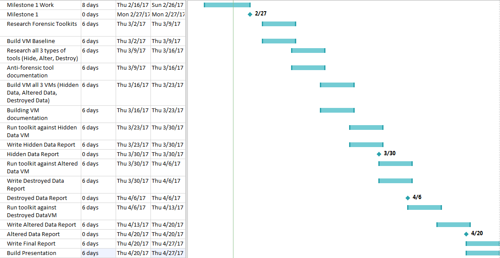
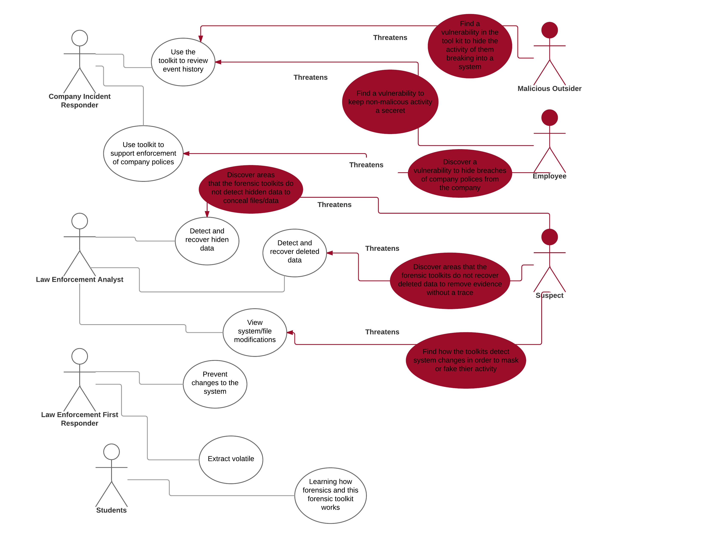
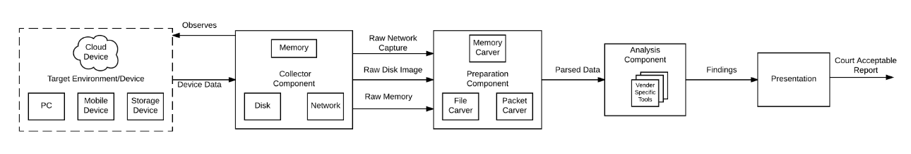
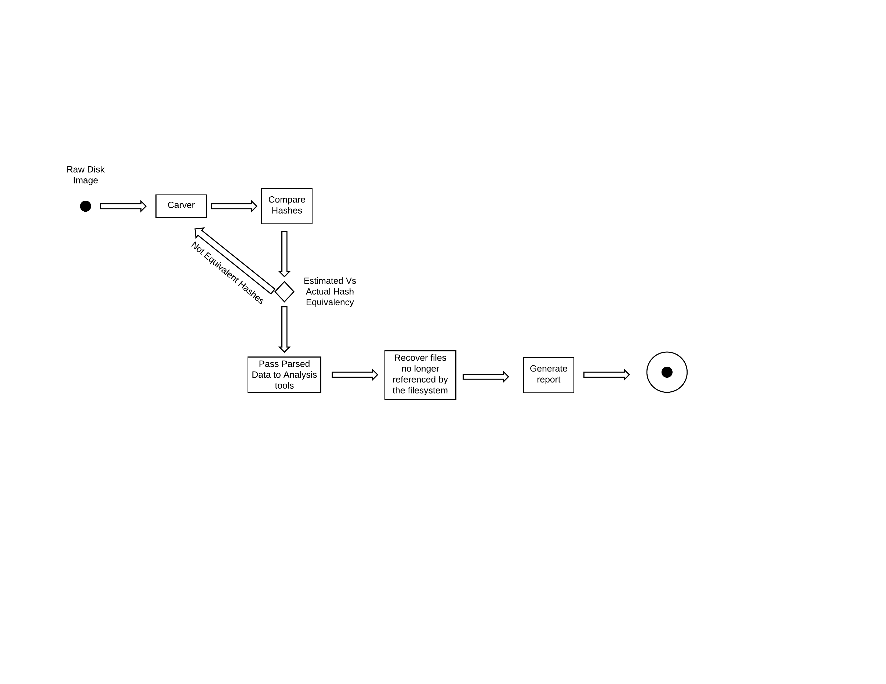
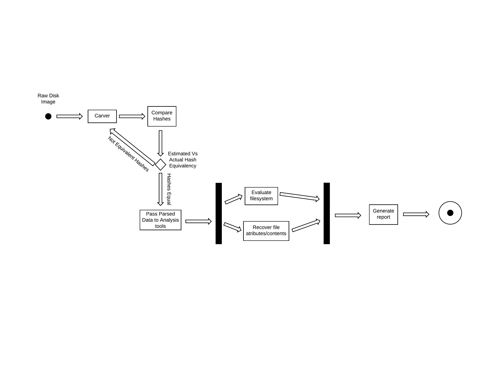

# Anti-Forensics

#### Table of Contents
- [Executive Project Summary](#executive-project-summary)
- [Proposed Project Timeline](#proposed-project-timeline)
- [Project-Oriented Risk List](#project-oriented-risk-list)
- [Application Requirements](#application-requirements)
- [Resources Needed](#resources-needed)
- [Architectural Diagram](#architectural-diagram)
- [Activity Diagrams](#activity-diagrams)
- [User Story Realization](#user-story-realization)

### Executive Project Summary

Law enforcement has a new era of issues to find solutions for due to the enormous amount of data from connected devices. Since humans are so reliant on using this technology, it comes to no surprise that many people are using this powerful technology to commit crimes. Thus, the task of collecting digital evidence that is admissible in court is left law enforcement.

Given that law enforcement wants to collect and use digital evidence in court to aid in the identification and conviction of criminals, there will be criminals and people out there who will want to thwart this collection process. This has evolved into the concept of anti-forensics. Through anti-forensics, wrong-doers aim to derail investigations by reducing the quality and quantity of potential digital evidence. Through this, the investigation may provide little insight into the act committed, allowing the offending party to escape the consequences of their actions.

The goal of our research is to generate a report that shows the strengths and weaknesses of widely used forensics toolkits. We will break down our research into the sections of: researching Anti-forensics tools for data hiding, data alteration, and data destruction, popular all-in-one forensics toolkits, and researching documentation strategies for evaluating these forensics toolkits.

Then, the research will move to building a virtual machine that has these tools and techniques used on the virtual machine, conducting forensic investigations with the forensic toolkits, and writing reports on the results.

After this project concludes, law enforcement, incident response, and digital forensic analysts will have a better understanding of the capabilities of these forensic toolkits. Also, this will be an overarching resource for developers to see where the strengths and weaknesses lie in their applications. Finally, this could show these professionals the weaknesses or shortcomings of the forensic toolkits that they could be using, which could lead to more complete toolkits being used or created.

### Proposed Project Timeline

### Project-Oriented Risk List

| Risk name (value) | Impact | Likelihood | Description |
|---|---|---|---|
| Can't find appropriate tools (25) |  5 | 5 | Tools do not exist or cannot be obtained to perform intended anti-forensic techniques. |
| Loss of team member (20) | 10 | 2 | An unexpected incident prevents a team member from contributing during the time of this study.|
| Tools don't work on VM (16) | 8 | 2 | Tools do not perform required functions when executed in a virtual environment. |
| Can't perform all of the techniques being explored (16) | 8 | 2 | Support does not exist within a virtual environment to apply all anti-forensic techniques.|
| Lost progress due to system crash (10) | 5 | 2 | Repeated loss of progress during the execution of forensic toolkits would greatly extend the time needed to perform the analysis of the generated VMs. |

### Application Requirements

##### User Story 1.
As a **Computer Forensic Analyst**, I want to **detect and recover hidden data** so I can **spot trails of evidence**
- AC 1.1: Using the digital forensics tool, the location of data hidden within the context of the system can be identified.
- AC 1.2: Using the digital forensics tool is able to recover data hidden within a given location.

##### User Story 2.
As a **Computer Forensic Analyst**, I want to **detect and recover deleted data** so I can **support/define a suspect's intent**
- AC 2.1: The digital forensics tool is able to detect all files whose pointers have been deleted and have not been completely overwritten in the file system.
- AC 2.2: The digital forensics tool is able to recover all portions of a file that have not been overwritten in the file system.

##### User Story 3. 
As a **Computer Forensic Analyst**, I want to **identify and understand system contents** so I can **develope an overview of user activities**
- AC 3.1: The digital forensics tool is able to retrieve user files and permissions, while also retrieving usernames and user activity logs.

##### User Story 4.
As a **Computer Forensic Analyst**, I want to **detect system modifications** so I can **construct a timeline of actions taken**
- AC 4.1: The digital forensics tool is able to detect changes to system logs
- AC 4.2: The digital forensics tool is able to detect changes to file attributes
- AC 4.3: The digital forensics tool is able to detect changes to the registry

##### User Story 5.
As a **Member of a Computer Incident Response Team**, I want to **view previous activity on a system** so I can **restore the system's availability**
- AC 5.1: The digital forensics tool is able to retrieve system configuration and settings, while also retrieving system activity logs.

#### Use Case Diagram

### Resources Needed

|Resource  | Dr. Hale needed? | Investigating Team member | Description |
|---|---|---|---|
| SANS Investigative Forensics Toolkit - SIFT | No | Casey | Target Forensics Toolkit |
| FTK | No | Brandon | Target Forensics Toolkit |
| Sleuth Kit | No | Preston | Target Forensics Toolkit |
| X-Ways Forensics | No | Preston | Optional Target Forensics Toolkit |
| Virtual Box | No | Brandon | Virtualization Environment for Evaluating Forensic Toolkits |
| Windows 7 ISO | No | Casey | Operating System used for Virtualized Environment |

### Architectural Diagram

##### Collector Component

The collector component interfaces with the target device to capture raw disk image and volatile memory dump. It intercepts raw network data to and from target device. Then, this component sends the captured data to the preparation component.

##### Preparation Component

The preparation component takes in the raw data provided by the collector component and carves it so that it may be easily leveraged by the analysis component of the forensic toolkit as parsed data. The network capture is parsed within the packet carver in which individual packets are derived and indexed. The raw disk image is parsed within the file carver which gathers the contents between file headers and indexes contents based on the given file's metadata. For handling raw memory, the contents are passed to memory the carver which generates parsed memory and packet information.

##### Analysis Component

Provided with data parsed by the preparation component, the analysis component provides an interface for conducting an investigation from which findings are derived.

##### Presentation Component

Provided with findings from the analysis component, the presentation component generates a court acceptable report relaying information contained in said findings.

### Activity Diagrams

##### Deleted Data Activity Diagram

##### Hidden Data Activity Diagram

##### System Contents Activity Diagram

### User Story Realization

In order to assess the abilities of forensic toolkits, various techniques were applied in order to challenge their core functionality. The effects of these techniques were evaluated through the execution of forensic toolkits upon a generated VM which contains examples of data hiding in a manner to counter digital forensics. The reports associated with each specific forensic toolkit can be found below.

##### User Story 1. Detect and Recover Hidden Data
- Embedding of Data
  - Accompanying Reports
     - [SANS SIFT Report](Documentation/Reports/SIFTHidingEval.md)
  - [Accompanying Data Hiding Research](/Documentation/Research/DataHidingToolDoc.md)
  - [Documentation regarding creation of the target VM](/Documentation/VM/DataHidingVMDoc.md)

##### User Story 2. Detect and Recover Deleted Data
- Deletion of Data
  - Resulting Reports
  - [Accompanying Data Hiding Research](Documentation/Research/DataDeletionToolDoc.md)
  - [Documentation regarding creation of the target VM](/Documentation/VM/DataDeletionVMDoc.md)
 
##### User Story 3. Detect and Recover System Contents
- Manipulation of Data
  - Resulting Reports
  - [Accompanying Data Alteration Research](Documentation/Research/DataAlterationToolDoc.md)
  - [Documentation regarding creation of the target VM](/Documentation/VM/DataAlterationVMDoc.md)
